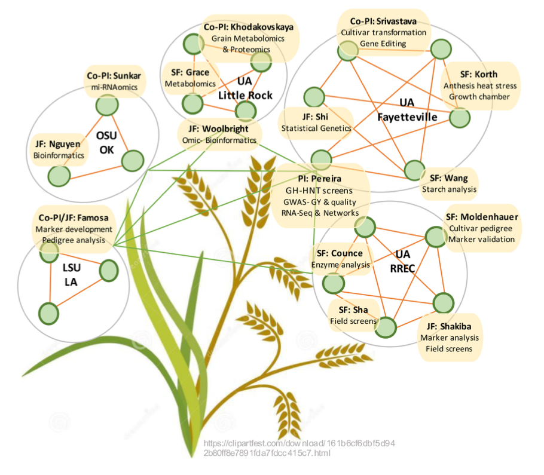

Award number:1826836  
Title: RII Track-2 FEC: Systems Genetics Studies on Rice Genomes for Analysis of 
Grain Yield and Quality Under Heat Stress  
Awardee Institution: University of Arkansas, Fayetteville (UAF)  
PI: Andy Pereira  
Participating institutions: 
&nbspUniversity of Arkansas-Little Rock, AR (UALR) 
&nbspOklahoma State University, Stillwater, OK (OSU) 
&nbspLouisiana State University, Baton Rouge, LA (LSU) 
</ul>

